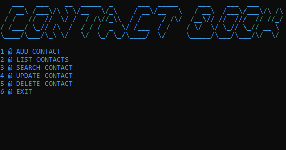

# 📒 Contact Book
  
> A simple **console-based Contact Book application** built with **C#**.

## 📌 Note  

A beginner-level project made to improve my skills in **CRUD logic** in a console app using C#.

## 💡 Features  

- Manage contacts with basic **CRUD operations** (Create, Read, Update, Delete)
- Add, edit, and remove contacts
- Search contacts by name
- View detailed list contact information

## 🛠️ Built With  

- C# (.NET)
- Console Application
